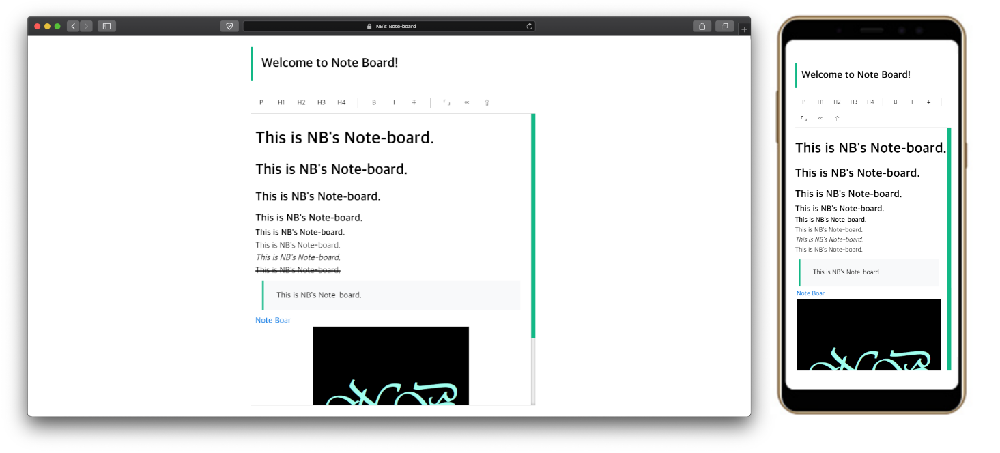

# NB' Note-Board version 1.1



> This library is simple HTML5 web text editor using the Contenteditable attribute.

- I'm sorry, Image inserting is not supported..😅
- Internet Explorer is not supported.😂


## Documentation

#### How to import?

- JS
  - nbtextedit.js
  - nbtextedit_min.js
- CSS
  - nbtextedit.css
  - nbtextedit_min.css

> Just select! but, keep relative path of files.


#### How to construct Editor?

1. Import javascript, css files.

2. Plz do this. So editor will be created in div that has 'NB-texteditor'.

   ```html
   <body>
   	<div id="NB-texteditor"></div>
   </body>
   <script>NBnote();</script>
   ```

3. You can choice these option!

   ```javascript
   NBnote(
   	color='#12b886',
   	link=true,
   	image=false,
   	eng=false
   );
   ```

   - color : Just select that color you like.

   - link : If you want insert link function, select 'true'.

   - image : If you want insert image function, select 'true'.

     > I'm Sorry..😅  Image inserting is not supported not yet.

   - eng : If you want to use by English, select 'true'.


#### How to get form data?

- Use this function.

  ```javascript
  let your_data = NBnoteData(title=false, post=false, images=false);
  ```

  (title = false) is default, (post=false) is default, (images=false) is default.

  This function will return FormData to you.


#### Contributions

Any kinds of contributions are welecomed. Since the test codes of the project is not completed yet, pull requests might take a while. 


###### 2020-04-11 xD